# Welcome to Darwin

The Darwin College Students’ Association (DCSA) welcomes you to Darwin for what is sure to be the start of a truly amazing year! The DCSA exists to represent the interests and welfare of Darwin students and does so by dealing with matters raised by students, providing budget for Darwin clubs and societies, organising social events, and by providing support for students. You can contact any committee member about any issue.
{: .text-justify}

You’ll always find a friendly face around Darwin, so don’t be scared to just say hello and introduce yourself to someone. It really is true what they say: you get out what you put in, so you should visit Darwin as much as you can, to make the most of college life.
{: .text-justify}

## Minutes of meetings and GMs

Please find the [General meeting's motions](https://drive.google.com/drive/folders/11tTTNB7E3WyPY07JaFyHgYwTBm2QyFzi?usp=sharing) here.

[EC Minutes](https://drive.google.com/drive/folders/1SOZxWncAs0WJbqdfSN1R20soiIxtdSCD?usp=sharing)

[EC resolutions](https://drive.google.com/drive/folders/1fjGT1VK8naco_KlAP8lleJe-v71hSfLb?usp=sharing)

[GM Minutes](https://drive.google.com/drive/folders/19PYVshwgP5STIgzL1XjRbcRmy392xsVb?usp=sharing)

[GM Motions](https://drive.google.com/drive/folders/11tTTNB7E3WyPY07JaFyHgYwTBm2QyFzi?usp=sharing)

## Meet the DCSA Executive Committee

<!-- Trinity -->
<table>
<tr>
    <td>
        <a href="images/DCSA/DCSA-President.jpg">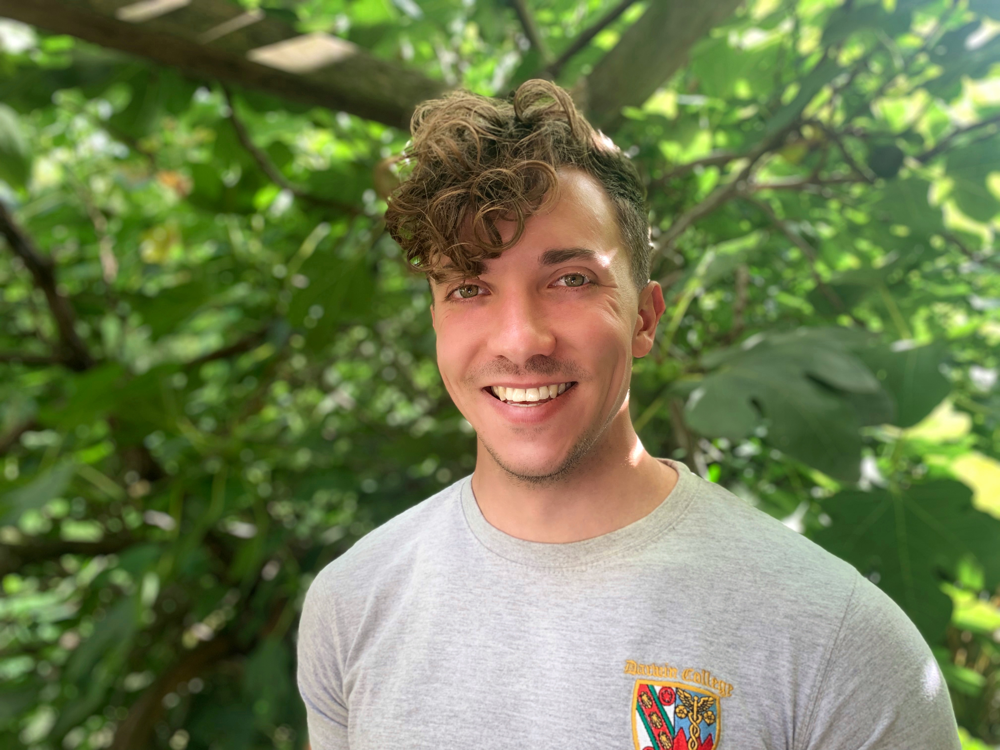</a>
    </td>
    <td style="vertical-align: middle">
        <strong>President</strong> 
        dcsa_president @ darwin.cam.ac.uk 
        Ryan PRESTIL 
        

The President is the representative of the DCSA to College, voicing the opinions of the students to all College members. They coordinate the committee by chairing DCSA Regular Meetings and General Meetings. The President works very closely with the Secretary, Treasurer, and the rest of the committee to ensure work is completed. The President sits on the College Council as a student representative, attends fortnightly CUSU meetings, sits on the Strategic Planning Committee, sits on the PREVENT committee, sits on the Health and Safety Committee, and often sits on one or two other college committees.
        

    </td></tr>

<tr>
    <td>
        <a href="images/DCSA/DCSA-Secretary.jpg">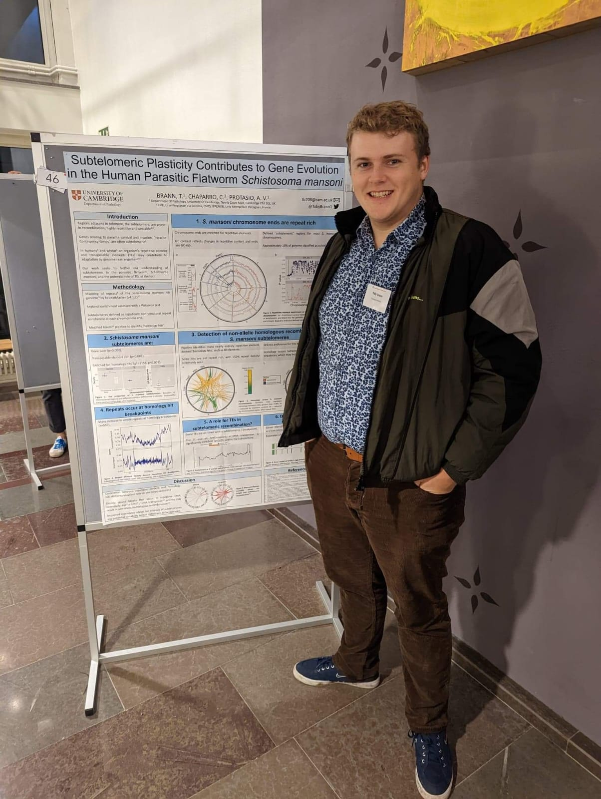</a>
    </td>
    <td style="vertical-align: middle">
        <strong>Secretary</strong> 
        dcsa_secretary @ darwin.cam.ac.uk 
        Chloé KATTAR 
        

The Secretary is the administrator of the committee and Vice President. Alongside the President they ensure that meetings and DCSA business run smoothly. The Secretary ensures up-to-date files of the DCSA’s affairs, minutes, and policy documents are maintained, including the DCSA Constitution and Schedule and Regulations. The Secretary is in charge of the TV room and its bookings, sits on the Building and Grounds Committee, and sit on the Darwin College Society Committee. Importantly, the Secretary is the person responsible for chairing meetings and running the committee, should the President be unavailable for any reason.
        

    </td></tr>

<tr>
    <td>
        <a href="images/DCSA/DCSA-Treasurer.jpg">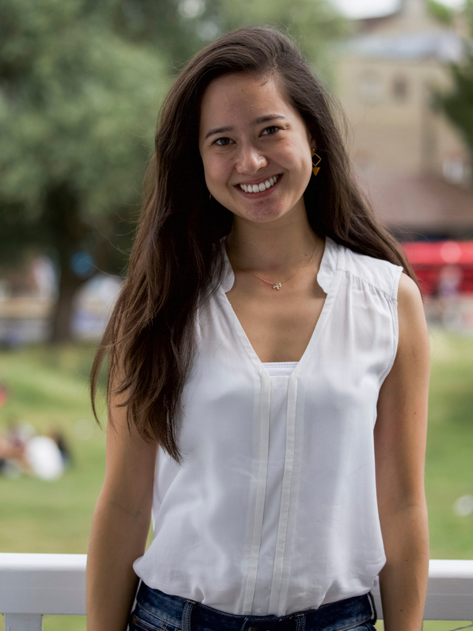</a>
    </td>
    <td style="vertical-align: middle">
        <strong>Treasurer</strong> 
        dcsa_treasurer @ darwin.cam.ac.uk 
        Carolina AZEREDO 
        

The Treasurer is in charge of all the finances in the DCSA, reports how much is spent, and assesses the feasibility of projects on a financial basis. They are responsible for ensuring all the clubs and societies are receiving the required funding whilst ensuring that the money they ask for is necessary for what they want to do. They are responsible for maintaining accurate records and checking the validity of all paperwork submitted for reimbursement. The Treasurer sits on the College Finance Committee.
        

    </td></tr>

<!-- Welfare and other -->
<tr>
    <td>
        
    </td>
    <td style="vertical-align: middle">
        <strong>Women’s Welfare Officer</strong> 
		dcsa_welfare @ darwin.cam.ac.uk 
		dcsa_womens_welfare @ darwin.cam.ac.uk 
        Alice FAIRNIE 
        

The Women’s Welfare Officer is the student contact for students who or in need of help or advice. They advise students on how to deal with their problems and who they should contact to get the help they require. The Women’s Welfare Officer is responsible for representing and furthering the needs of female students. Along with the Men's Welfare Officer, they will organise welfare events throughout the year.
       

    </td></tr>

<tr>
    <td>
        <a href="images/DCSA/DCSA-Welfare-Men.jpg">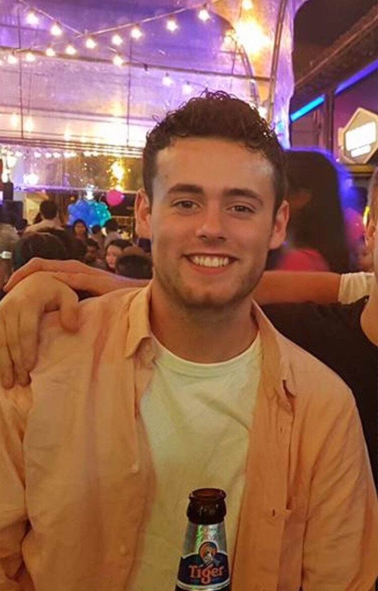</a>
    </td>
    <td style="vertical-align: middle">
        <strong>Men’s Welfare Officer</strong> 
		dcsa_welfare @ darwin.cam.ac.uk 
		dcsa_mens_welfare @ darwin.cam.ac.uk 
        Patrick MORTIMER 
        

The Men’s Welfare Officer is the student contact for students who or in need of help or advice. They advise students on how to deal with their problems and who they should contact to get the help they require. The Men’s Welfare Officer is responsible for representing and furthering the needs of male students. Along with the Women's Welfare Officer, they will organise welfare events throughout the year.
       

    </td></tr>

<tr>
    <td>
        <a href="images/DCSA/DCSA-Women.jpg">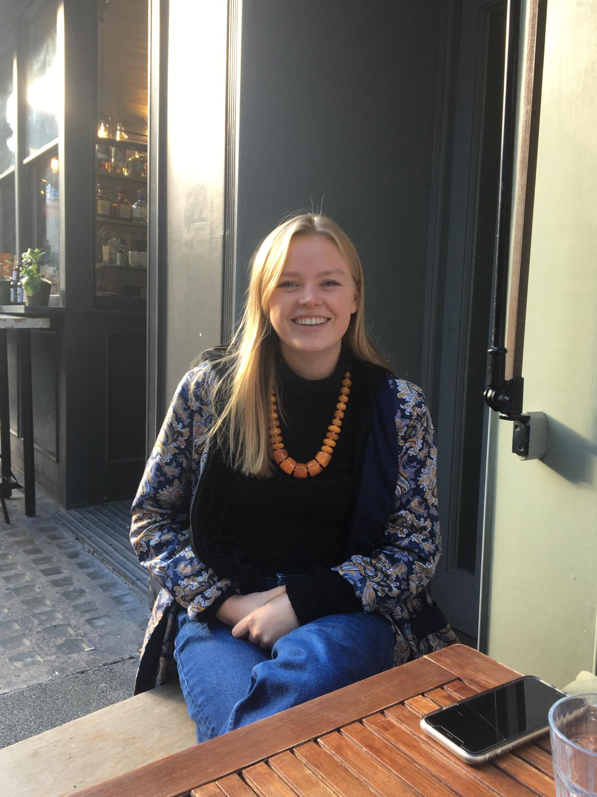</a>
    </td>
    <td style="vertical-align: middle">
        <strong>Women's Officer</strong> 
		dcsa_women @ darwin.cam.ac.uk 
		Meg Majumder 
         
        

text missing
        

    </td></tr>

<tr>
    <td>
        
    </td>
    <td style="vertical-align: middle">
        <strong>LGBTQ+ Officer</strong> 
		dcsa_lgbtq @ darwin.cam.ac.uk 
        Arthur DAVIS 
        

The LGBTQ+ Officer is responsible for representing and furthering the needs of LGBTQ students, whilst also providing
help in a similar manner to the Welfare Officers. They try to involve LGBTQ+ students in college events and organise
events aimed at LGBTQ+ students.
        

    </td></tr>

<!-- Alphabetical -->
<tr>
    <td>
        <a href="images/DCSA/DCSA-Admiral.jpg">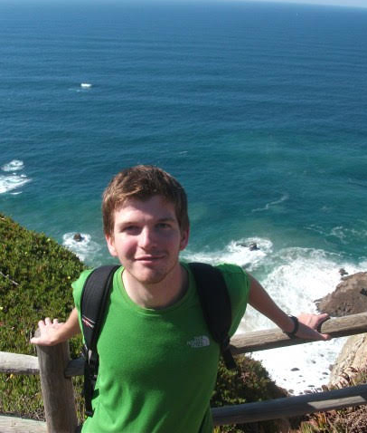</a>
    </td>
    <td style="vertical-align: middle">
        <strong>Admiral of the Punts</strong> 
		dcsa_punts @ darwin.cam.ac.uk 
		James MACDONALD 
        

The Admiral of the Punts is responsible for all the vessels the punt club owns, including the punts, kayaks, canoe, and the equipment which comes along with them. They are the President of the Punt Club and manage the membership, the finanical and administrative work, and the maintenance of the vessels. They work with several trusted punt captains to ensure the work is done.
        

    </td></tr>

<tr>
    <td>
        <a href="images/DCSA/DCSA-College-Council-I.jpg">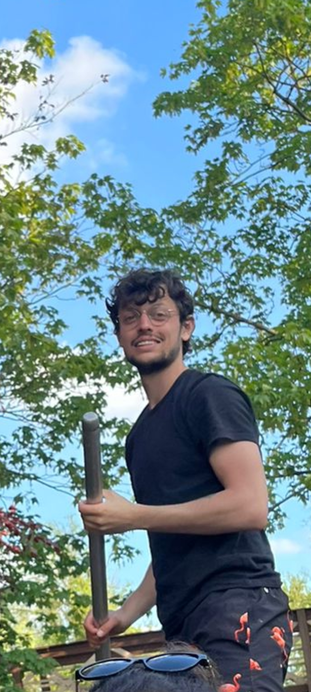</a>
    </td>
    <td style="vertical-align: middle">
        <strong>College Council Representative I</strong> 
        dcsa_council_reps @ darwin.cam.ac.uk 
        Christopher DAVIS 
        

The College Council Reps are elected by the students to represent the College in College Council meetings and sit ex officio on the DCSA Executive Committee (meaning their Primary Office is the College Council). They bring any matters to the College Council and the DCSA and try to ensure that the needs of all parties in College are being met.
        

    </td></tr>

<tr>
    <td>
        <a href="images/DCSA/DCSA-Communications.jpg">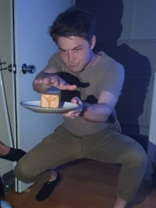</a>
    </td>
    <td style="vertical-align: middle">
        <strong>Communications Officer</strong> 
         dcsa_coms @ darwin.cam.ac.uk 
         Michael SCHNEIDEr 
        

The Comms Officer is responsible for sending out the Whatsup emails, helping to maintain the website, and to otherwise attend to the DCSA communication needs. The Comms Officer sits on the Information Services Committee.
        

    </td></tr>

<tr>
    <td>
        <a href="images/DCSA/DCSA-Ents-I.jpg">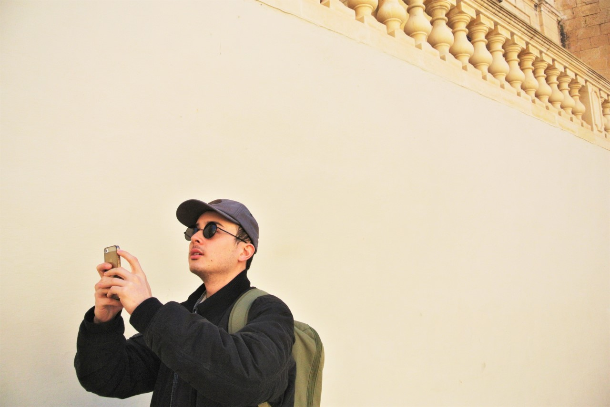</a>
    </td>
    <td style="vertical-align: middle">
		<strong>Entertainment Officer I</strong> 
		dcsa_ents @ darwin.cam.ac.uk 
		Mimy PHAM 
        

The Ents Officers coordinate, organise, and promote the Darwin BOPs, held roughly three times a term. They are responsible for the music, decorations, security, and all the other financial and administrative work that comes with it.
        

    </td></tr>

<tr>
    <td>
        
    </td>
    <td style="vertical-align: middle">
		<strong>Entertainment Officer II</strong> 
		dcsa_ents @ darwin.cam.ac.uk 
		Louise DE THOMASSON 
        

The Ents Officers coordinate, organise, and promote the Darwin BOPs, held roughly three times a term. They are responsible for the music, decorations, security, and all the other financial and administrative work that comes with it.
        

    </td></tr>
<tr>
    <td>
        <a href="images/DCSA/DCSA-Environment-Ethics.jpg">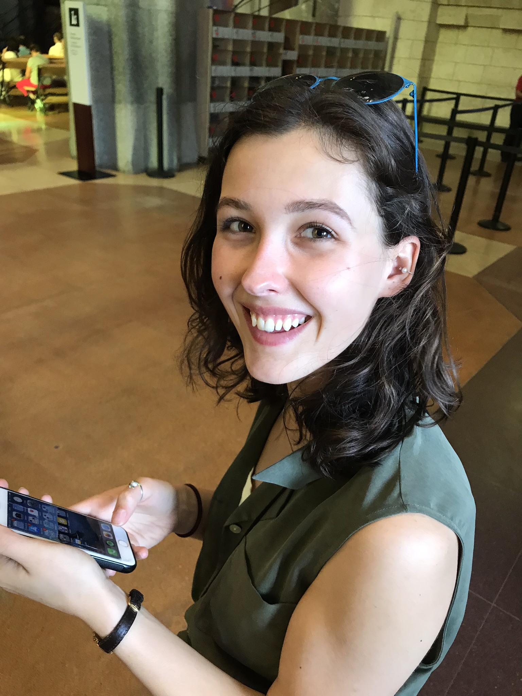</a>
    </td>
    <td style="vertical-align: middle">
        <strong>Environmental and Ethical Affairs Officer</strong> 
         dcsa_green @ darwin.cam.ac.uk 
         Conor Cooper 
        

The Environmental and Ethical Affairs Officer is responsible for the coordination and implementation of environmental
and ethical issues and organises college events promoting awareness of these issues. They manage the student
vegetable garden and they can sit on the Buildings and Grounds Committee if requested.
        

    </td></tr>

<tr>
    <td>
        <a href="images/DCSA/DCSA-Events.jpg">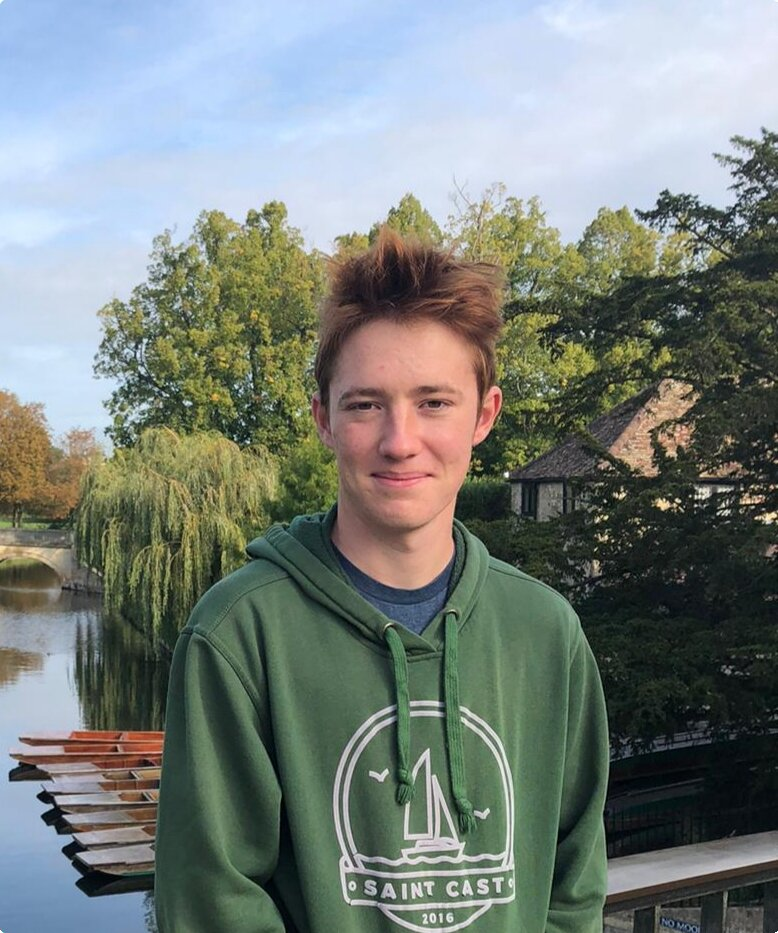</a>
    </td>
    <td style="vertical-align: middle">
        <strong>Events Officer</strong> 
         dcsa_events @ darwin.cam.ac.uk 
         Chanon PORNRUNGROJ 
        

The Events Officer coordinates, organises, and promotes social and entertainment activities in college, including the May Week Garden Party, summer BBQ, and other smaller events throughout the year.
        

    </td></tr>

<tr>
    <td>
        
    </td>
    <td style="vertical-align: middle">
        <strong>External Officer</strong> 
         dcsa_external @ darwin.cam.ac.uk 
         Daniel KOTTMANN 
        

The External Officer is responsible for organising Formal swaps with other Colleges and for hosting other Colleges when they visit Darwin for Formal swap. They also represent the DCSA at CUSU meetings.
        

    </td></tr>

<tr>
    <td>
        <a href="images/DCSA/DCSA-International.jpg">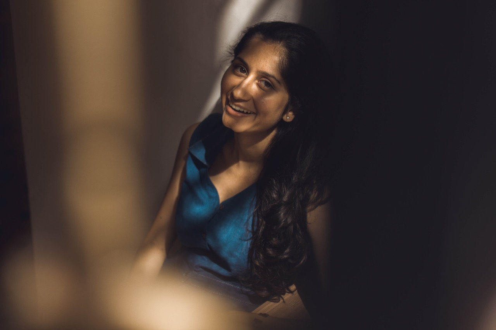</a>
    </td>
    <td style="vertical-align: middle">
        <strong>International Officer</strong> 
         dcsa_international @ darwin.cam.ac.uk 
		 Narendra MEENA 
        

The International Officer is responsible for representing and furthering the needs of international students, whilst also providing help in a similar manner to the Welfare Officers. They try to involve international students in college events and organise events aimed at international students.
        

    </td></tr>

<tr>
    <td>
        <a href="images/DCSA/DCSA-Sports-Societies-I.jpg">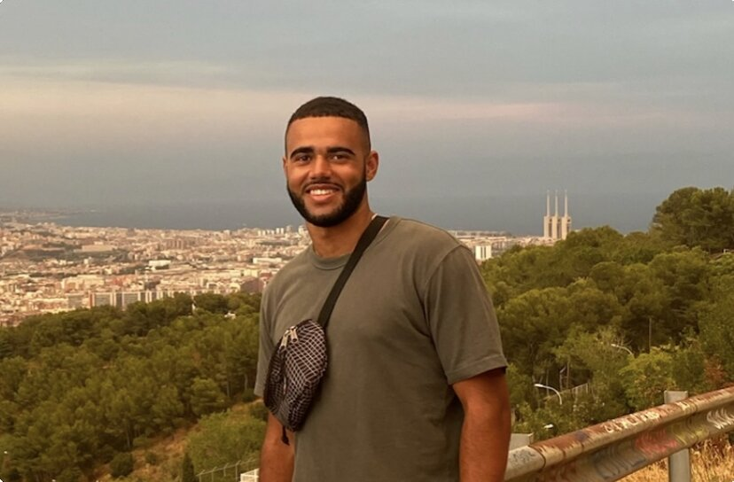</a>
    </td>
    <td style="vertical-align: middle">
        <strong>Sports and Societies Officer I</strong> 
         dcsa_sports @ darwin.cam.ac.uk 
         Daniel BUHL 
        

The Sports and Societies Officers are responsible for maintaining the gym and for overseeing Darwin’s sporting societies. They are also responsible for organising the Darwin-Wolfson Sports Day, a day of sporting fun against our sister College at Oxford, held every March.
        

    </td></tr>

<tr>
    <td>
        
    </td>
    <td style="vertical-align: middle">
        <strong>Sports and Societies Officer I</strong> 
         dcsa_sports @ darwin.cam.ac.uk 
         Trevor COUSINS 
        

The Sports and Societies Officers are responsible for maintaining the gym and for overseeing Darwin’s sporting societies. They are also responsible for organising the Darwin-Wolfson Sports Day, a day of sporting fun against our sister College at Oxford, held every March.
        

    </td></tr>

</table>

### Ex officio officers

<table>
<tr>
    <td>
         
    </td>
    <td style="vertical-align: middle">
        <strong>Bar Committee Chair</strong> 
        dcsa_bar @ darwin.cam.ac.uk 
        Matthew BRADY 
        

The Barcomm Chair is not voted on to the DCSA Executive Committee, as with all other positions, but sits ex officio on the committee. The BarComm Chair is in charge of the Bar Committee, which runs the Darwin Bar (Darbar).
        

    </td></tr>

<tr>
    <td>
       
    </td>
    <td style="vertical-align: middle">
        <strong>President of the Families Society</strong> 
        dcsa_families @ darwin.cam.ac.uk 
        Janna HASTINGS 
        

The President of the Families Society is not voted on to the DCSA Executive Committee, as with all other positions, but sits ex officio on the committee. The President of the Families Society is responsible for representing and furthering the needs of students with families. They try to involve students with families in college events and organise events aimed at these students through the families society.
        

    </td></tr>

</table>

# Constitution and Schedule and Regulations

[DCSA Constitution and Schedule and Regulations](https://drive.google.com/drive/folders/1YTp015nqyTUjO1NJg8bwB_aFXKm0IE2C?usp=sharing)
